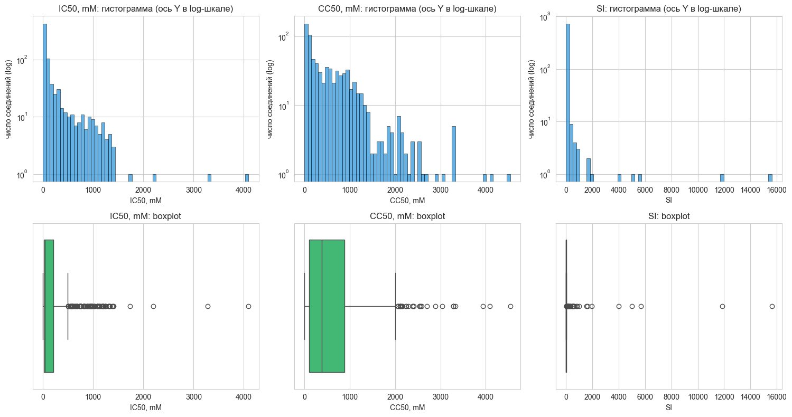
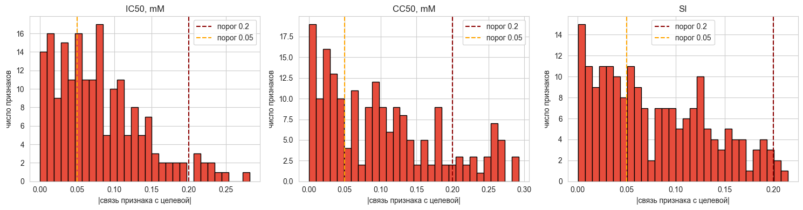
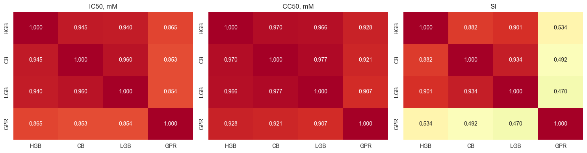
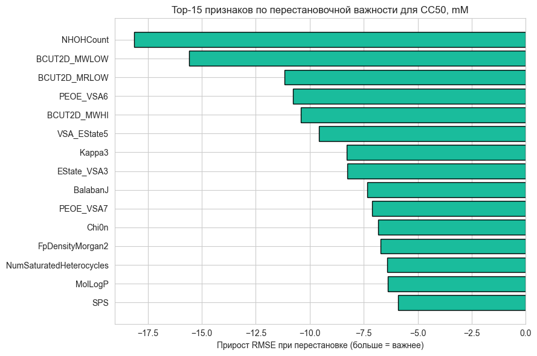

# Отчёт по исследованию

Команда 26. Хакатон по фармацевтической разработке, 2026.

В этом документе описаны основные наблюдения по данным, гипотезы, которые из них следовали, и выводы по работе. Подробности кода и промежуточные шаги - в solution.ipynb; этот файл не пересказывает ноутбук, а объясняет логику выбора методов.

Финальный результат на публичной таблице Kaggle: **266.95631**.

## Задача

По 210 молекулярным дескрипторам для 751 соединения обучить модель, предсказывающую три величины: IC50, CC50, SI = CC50 / IC50. Тест - 250 соединений. Метрика - среднее RMSE по трём целевым.

## Наблюдения и гипотезы

EDA дал три наблюдения, каждое из которых превратилось в требование к методу.

### Тяжёлые правые хвосты целевых

У всех трёх целевых тяжёлые правые хвосты. SI - крайний случай: медиана около 5, максимум 15620 (в 3000 с лишним раз больше медианы), коэффициент асимметрии 15.63. Гистограммы рисуются в log-шкале по оси Y только чтобы хвост вообще было видно.

RMSE возводит остаток в квадрат, поэтому один объект с истинным SI = 15000 и предсказанием 100 даёт вклад в сумму квадратов на уровне нескольких тысяч обычных объектов с ошибкой 30. Метрика остро чувствительна к таким выбросам.

**Гипотеза.** Работать с этим нужно через устойчивую функцию потерь (L1) на этапе обучения, а не через log-преобразование целевой. log-преобразование не работает потому, что RMSE считается на исходной шкале и эффект логарифмирования при обратном преобразовании теряется.

### Слабые одиночные связи признаков с целевыми

Максимальные коэффициенты Спирмана признака с целевой: 0.282 для IC50, 0.292 для CC50, 0.214 для SI. На графиках видно, что большинство признаков имеют корреляцию ниже 0.05 - они почти бесполезны по одиночке. Это значит, что полезный сигнал в данных не в одиночных признаках, а в их взаимодействиях.

**Гипотеза.** Отбирать признаки по одиночной корреляции с целевой нельзя - этот критерий выкинет всё. Нужны методы, умеющие ловить взаимодействия: деревья и/или ядерные методы.

### Малая выборка

751 объект на 210 признаков (N/p около 3.6). Это уже на грани, при которой любая нерегуляризованная модель будет переобучаться.

**Гипотеза.** Нужен либо бэггинг, либо явная регуляризация, либо и то и другое.

## Решения по архитектуре

Из карты проблем сложилась архитектура решения.

**Базовые модели.** Четыре семейства, каждое отвечает на ограничения карты:

- HistGradientBoosting, CatBoost, LightGBM - все с loss = L1, обёрнутые в bagging (10-20 копий на bootstrap-подвыборках). Деревья + L1 + бэггинг - ответ на все три ограничения сразу.
- Gaussian Process с ядром Matern (nu = 2.5) и WhiteKernel. Преобразует kernel-пайплайн: импутация медианой, удаление 18 константных признаков, стандартизация. GPR добавлен по отдельной причине - см. следующий раздел.

**Кросс-валидация.** 5-fold KFold с фиксированным SEED = 42. Для каждого объекта получаем out-of-fold предсказание модели, не видевшей его при обучении. Все решения по структуре конвейера принимаются на OOF, тест не используется до финального сабмита - это исключает утечку.

**Базовая линия (Ridge).** Перед тем как строить ансамбль, проверяем Ridge как baseline. OOF RMSE: 345.41 / 494.47 / 788.48. Этого достаточно, чтобы убедиться - линейная модель упирается ровно в те ограничения, которые нашёл EDA.

## Почему GPR добавлен к бустингам

После обучения трёх бустингов проверили попарные корреляции остатков:

Левый и средний квадраты (IC50, CC50) - все три бустинга скоррелированы на 0.94-0.97. Это значит, что они ошибаются на одних и тех же объектах в одну и ту же сторону. Усреднение трёх таких моделей даёт минимальный выигрыш.

GPR (правая колонка / нижняя строка) показывает другую картину. На SI корреляция остатков GPR с любым из бустингов - 0.47-0.53, заметно ниже, чем между самими бустингами (0.88-0.93). Это и есть тот самый декоррелированный источник сигнала, которого не хватало.

OOF RMSE GPR: 321.62 / 457.05 / 776.75. Он лучше любого бустинга по всем трём целевым - но главное не это, а именно низкая корреляция с ними.

## Смешивание и калибровка

Веса смешивания подобраны методом NNLS на OOF-предсказаниях:

- IC50: HGB = 0.000, CB = 0.110, LGB = 0.368, GPR = 0.522
- CC50: HGB = 0.113, CB = 0.384, LGB = 0.000, GPR = 0.503
- SI: равные веса {0.25, 0.25, 0.25, 0.25}

На IC50 и CC50 GPR получает примерно половину веса, что подтверждает - он несёт полезный сигнал.

Для SI взяли равные веса вместо NNLS. Перебор NNLS на SI даёт нестабильные веса между фолдами из-за тяжёлого хвоста: несколько объектов с экстремальными значениями могут резко изменить решение. Равные веса дают чуть худший OOF, но устойчивы.

Калибровка отсечения - отсечение по физическим границам: ниже 0 ничего не должно быть, сверху 1.5 * p99(train) для IC50 и CC50 как защитный порог, для SI эмпирический порог 221 подобран сеткой на OOF. На IC50 и CC50 отсечение не срабатывает (ансамбль и так не выдаёт экстремальных предсказаний); для SI даёт небольшое улучшение 782.31 -> 782.05.

## Распределение важности признаков

Permutation importance посчитана на HGB для CC50 (на других целевых картина качественно та же). Сигнал распределён по десяткам признаков. Топ-15 покрывают разные типы дескрипторов: NHOHCount (число OH-групп), BCUT2D_* (топологические дескрипторы), PEOE_VSA* (поверхность с учётом заряда), VSA_EState* (электротопологическое состояние), Kappa3 (форма), BalabanJ (индекс).

Это подтверждает наблюдение EDA: одиночные признаки слабые, информация в комбинациях. Отбор по топ-30 признакам ухудшил бы качество.

## Результаты

OOF RMSE по этапам:

| Этап                | IC50    | CC50    | SI      | Среднее |
|---------------------|---------|---------|---------|---------|
| Ridge (baseline)    | 345.41  | 494.47  | 788.48  | 542.79  |
| HGB-bag             | 330.00  | 463.69  | 788.37  | 527.35  |
| CatBoost-bag        | 328.69  | 462.65  | 787.10  | 526.15  |
| LightGBM-bag        | 325.89  | 468.70  | 788.29  | 527.62  |
| GPR                 | 321.62  | 457.05  | 776.75  | 518.47  |
| Ансамбль NNLS       | 319.69  | 452.63  | 782.31  | 518.21  |
| Ансамбль + clip     | 319.66  | 452.63  | 782.05  | 518.11  |

Основной выигрыш дали два перехода: от линейной модели к бустингам (около 15 пунктов в среднем) и от бустингов к GPR (ещё около 9 пунктов). Смешивание и калибровка - дополнительные пол-пункта.

На публичном leaderboard Kaggle - **266.95631**. Это примерно в два раза лучше среднего OOF RMSE (518.11). Объяснение: в тестовой выборке нет таких экстремальных значений SI, как в обучении (где встречаются объекты с SI до 15620), и SI-RMSE на тесте не утягивает среднее так же сильно.

## Выводы

В рамках данного проекта нами было проведено исследование данных о биологической активности 751 химического соединения против вируса гриппа и построена модель прогнозирования трёх показателей: IC50, CC50 и SI по 210 молекулярным дескрипторам.

Анализ распределения целевых величин показал тяжёлые правые хвосты (коэффициент асимметрии SI равен 15.63 при медиане около 5), что определило выбор устойчивой к выбросам функции потерь L1 на этапе обучения. Анализ корреляций признаков с целевыми показал, что одиночные связи слабые (максимальный коэффициент Спирмана 0.282), а полезный сигнал сосредоточен в многомерных взаимодействиях. Это определило выбор моделей, способных захватывать такие взаимодействия: деревьев и ядерных методов.

Применили ансамбль из четырёх базовых моделей: трёх семейств градиентного бустинга (HistGradientBoosting, CatBoost, LightGBM) с функцией потерь L1 и бэггингом, и Gaussian Process с ядром Matern. Веса смешивания подобраны методом NNLS на out-of-fold предсказаниях; для SI использованы равные веса в силу нестабильности NNLS на тяжёлом хвосте. Применили отсечение предсказаний по физическим границам.

Получили среднее out-of-fold RMSE 518.11 и итоговый результат на публичной таблице Kaggle 266.95631. Основной выигрыш относительно линейной базовой модели (среднее RMSE 542.79) обеспечен двумя факторами: переходом от линейной модели к бустингам с L1 и добавлением Gaussian Process как декоррелированного источника сигнала по отношению к семейству деревьев.

Полный код решения - в [solution.ipynb](solution.ipynb).
