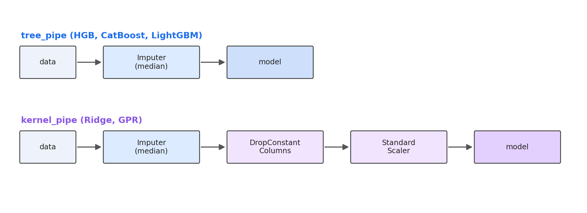

# Прогнозирование биоактивности соединений против вируса гриппа

Команда 26

Хакатон по фармацевтической разработке, 2026

Финальный результат на публичной таблице Kaggle: 266.95631

---

## Постановка задачи

По 210 молекулярным дескрипторам предсказать три величины для каждого химического соединения:

- **IC50 (мМ)** - концентрация подавления 50% активности вируса. Меньше - лучше.
- **CC50 (мМ)** - концентрация токсичности для 50% клеток. Больше - безопаснее.
- **SI** - индекс селективности CC50 / IC50. Больше - избирательнее.

Метрика качества:

    score = ( RMSE(IC50) + RMSE(CC50) + RMSE(SI) ) / 3

Размеры выборок: 751 соединение в обучающей, 250 в тестовой.

---

## Карта проблем задачи

Перед тем как выбирать методы, фиксируем три ограничения, которые показал EDA. Дальше каждое решение в работе - ответ на одно из них.

| #   | Ограничение                              | Цифра                                  | Что из этого следует             |
|-----|------------------------------------------|----------------------------------------|----------------------------------|
| 1   | Малая выборка                            | N / p = 751 / 210 ~ 3.6                | Бэггинг, регуляризация           |
| 2   | Тяжёлые хвосты целевых                   | SI: медиана ~ 5, максимум 15620        | Устойчивая функция потерь (L1)   |
| 3   | Слабые одиночные связи признаков         | Спирман: IC50=0.282, CC50=0.292, SI=0.214 | Деревья и/или ядерные методы  |

---

## EDA: распределения целевых

Все три целевые с тяжёлыми правыми хвостами. SI - крайний случай:

- Медиана: ~ 5
- Максимум: 15620
- Коэффициент асимметрии: 15.63

**Почему это проблема.** RMSE возводит остаток в квадрат. Один объект с SI = 15000 и предсказанием 100 даёт вклад порядка 2 * 10^8 в сумму квадратов - столько же, сколько несколько тысяч обычных объектов с ошибкой 30.

**Решение.** Брать функцию потерь L1 (MAE) в основных моделях. L1 одинаково взвешивает все остатки, единичные выбросы не утягивают модель.

> Логарифмическое преобразование целевых не подходит: RMSE считается на исходной шкале, обратное преобразование не компенсирует эффект на этапе предсказания.

---

## EDA: признаковое пространство

**Одиночные корреляции слабые.** Максимальные значения коэффициента Спирмана признака с целевой:

| Целевая | Max rho | Признаков с rho > 0.2 |
|---------|---------|-----------------------|
| IC50    | 0.282   | 10                    |
| CC50    | 0.292   | 28                    |
| SI      | 0.214   | 3                     |

Полезный сигнал в данных не в одиночных признаках, а в их комбинациях. Значит, отбирать признаки по одиночной корреляции нельзя.

**Мультиколлинеарность не критична.** Из 18336 пар признаков только 1.3% имеют коэффициент модуля корреляции выше 0.8.

**Пропуски и константы.** 24 пропуска на 158 тысяч ячеек (меньше 0.02%) и 18 константных признаков. Импутируем медианой, константные удалим там, где они вредят (для ядерных методов).

---

## Предобработка: два конвейера

**Почему два пайплайна.** Деревья инвариантны к масштабу и нечувствительны к константам - им хватает импутации. Ядерные методы зависят от масштаба (для обусловленности матрицы ядра) и не переносят константных признаков (нулевая дисперсия даёт деление на ноль при стандартизации).

---

## Кросс-валидация

При выборке в 751 объект оценка качества по одному отложенному множеству имеет высокую дисперсию. Используем 5-fold KFold:

- Каждый объект попадает в валидацию ровно один раз.
- Для каждого объекта получаем out-of-fold (OOF) предсказание модели, не видевшей его при обучении.
- OOF-предсказания используются для оценки качества базовых моделей, подбора весов смешивания, выбора порогов отсечения.

**Тестовая выборка вообще не участвует в принятии решений** о структуре конвейера. Это исключает утечку информации.

Все источники случайности фиксированы: SEED = 42.

---

## Baseline: Ridge

Прежде чем браться за сложные модели, нужна нижняя граница качества. Берём Ridge (линейная регрессия с L2-регуляризацией, alpha = 10) поверх kernel-пайплайна.

| Целевая | OOF RMSE |
|---------|---------|
| IC50    | 345.41  |
| CC50    | 494.47  |
| SI      | 788.48  |
| Среднее | 542.79  |

На SI ошибка 788 при типичных значениях около 5 - линейная модель здесь не работает. Этого и ждали по EDA: одна линейная зависимость не ловит взаимодействия признаков, а её квадратичная функция потерь чувствительна к выбросам в целевых.

---

## Бустинги с L1 и бэггингом

Берём градиентный бустинг по деревьям в трёх реализациях с разными деталями:

- HistGradientBoosting (sklearn) - loss = absolute_error
- CatBoost - loss_function = MAE
- LightGBM - objective = regression_l1

Деревья ловят взаимодействия признаков, в которых сосредоточен сигнал по данным EDA. Функция потерь L1 устойчива к выбросам в целевых. Каждую модель оборачиваем в bagging - усреднение предсказаний по нескольким bootstrap-копиям снижает дисперсию при малой выборке.

| Модель      | Мешков | Особенности                            |
|-------------|--------|----------------------------------------|
| HGB         | 20     | row_bootstrap=True, тюнинг гиперпарам.|
| CatBoost    | 10     | встроенный bootstrap, subsample=0.8   |
| LightGBM    | 20     | subsample=0.8                          |

**OOF RMSE (среднее по целевым):** HGB 527.35, CatBoost 526.15, LightGBM 527.62. Все три - примерно на 15 пунктов лучше Ridge.

---

## Проблема: бустинги ошибаются одинаково

Усреднение трёх моделей даст выигрыш только если они ошибаются на разных объектах. Проверяем попарные корреляции остатков (Спирман).

Среднее по парам {HGB, CatBoost, LightGBM}:

| Целевая | Средняя корреляция остатков |
|---------|-----------------------------|
| IC50    | 0.948                       |
| CC50    | 0.971                       |
| SI      | 0.906                       |

**Все три бустинга видят данные одинаково.** Это ожидаемо: у них один и тот же принцип работы (жадный бустинг по деревьям), отличия лишь в технических деталях.

Дальнейшее улучшение требует **модели с другим устройством** - такой, которая будет ошибаться иначе.

---

## Гауссовский процесс

Альтернатива деревьям - гладкая интерполяция через функцию похожести объектов в признаковом пространстве. Это и есть GPR.

**Параметры:**

    kernel = ConstantKernel() * Matern(nu=2.5) + WhiteKernel()
    n_restarts_optimizer = 5

Препроцессинг - kernel_pipe (импутация, удаление 18 константных, стандартизация). Без этого матрица ядра 750 на 750 плохо обусловлена.

**OOF RMSE:**

| Целевая | GPR    | Лучший бустинг | Дельта  |
|---------|--------|----------------|---------|
| IC50    | 321.62 | 325.89 (LGB)   | -4.27   |
| CC50    | 457.05 | 462.65 (CB)    | -5.60   |
| SI      | 776.75 | 787.10 (CB)    | -10.35  |

GPR лучше любого из бустингов. Корреляция остатков GPR с бустингами на SI: 0.47-0.53 - заметно ниже, чем между бустингами (0.88-0.96). **Это и есть декоррелированный источник сигнала.**

---

## Смешивание: NNLS на OOF

Имеем 4 OOF-предсказания. Ищем веса w >= 0, минимизирующие OOF RMSE взвешенного среднего. Это NNLS из scipy.

Сравниваем три варианта весов:

1. **Raw NNLS** - решение без нормировки. Лучший RMSE, но веса с произвольным масштабом.
2. **NNLS-simplex** - нормировка на сумму. Чуть хуже raw (на 0.1-0.3 пункта), но интерпретируемо.
3. **Equal** - {0.25, 0.25, 0.25, 0.25}. Контрольный baseline.

**Выбор по целевой:**

| Целевая | Метод       | HGB   | CB    | LGB   | GPR   | OOF RMSE |
|---------|-------------|-------|-------|-------|-------|----------|
| IC50    | NNLS-simplex| 0.000 | 0.110 | 0.368 | 0.522 | 319.69   |
| CC50    | NNLS-simplex| 0.113 | 0.384 | 0.000 | 0.503 | 452.63   |
| SI      | Equal       | 0.250 | 0.250 | 0.250 | 0.250 | 782.31   |

Для SI берём equal: тяжёлый хвост делает NNLS-веса неустойчивыми между фолдами.

---

## Калибровка отсечения

Все три целевые по своему смыслу неотрицательные. Регрессионные модели могут выдавать отрицательные предсказания. Отсекаем снизу нулём.

**Сверху - защитный порог.** Для IC50 и CC50 берём 1.5 * p99(train):

- IC50: clip [0, 2001.4]
- CC50: clip [0, 4743.0]

На OOF проверили: ансамбль и так не выдаёт предсказаний выше этих порогов, отсечение нигде не срабатывает. Это страховка на случай экстремальных предсказаний на тесте.

**Для SI - эмпирический порог.** Перебираем сетку от 100 до 1000, выбираем минимум OOF RMSE.

- SI: clip [0, 221], OOF RMSE 782.31 -> 782.05 (дельта -0.26)

---

## Важность признаков

Permutation importance на HGB для целевой CC50. Топ-10 признаков по приросту RMSE при перемешивании:

| #  | Признак         | Прирост RMSE |
|----|-----------------|--------------|
| 1  | NHOHCount       | 18.1         |
| 2  | BCUT2D_MWLOW    | 15.6         |
| 3  | BCUT2D_MRLOW    | 11.2         |
| 4  | PEOE_VSA6       | 10.8         |
| 5  | BCUT2D_MWHI     | 10.4         |
| 6  | VSA_EState5     | 9.6          |
| 7  | Kappa3          | 8.3          |
| 8  | EState_VSA3     | 8.3          |
| 9  | BalabanJ        | 7.3          |
| 10 | PEOE_VSA7       | 7.1          |

**Сигнал распределён по десяткам признаков, нет одного доминирующего.** Это согласуется с тем, что показал EDA: полезная информация в комбинациях признаков, а не в отдельных. Отбор по одиночной важности ухудшил бы качество - используем все 210.

---

## Итоги: OOF RMSE по этапам

| Этап                | IC50    | CC50    | SI      | Среднее | Что вкладывает шаг              |
|---------------------|---------|---------|---------|---------|---------------------------------|
| Ridge (baseline)    | 345.41  | 494.47  | 788.48  | 542.79  | -                               |
| HGB-bag             | 330.00  | 463.69  | 788.37  | 527.35  | Деревья + L1 + бэггинг (-15)    |
| CatBoost-bag        | 328.69  | 462.65  | 787.10  | 526.15  | То же другая реализация         |
| LightGBM-bag        | 325.89  | 468.70  | 788.29  | 527.62  | То же                           |
| GPR                 | 321.62  | 457.05  | 776.75  | 518.47  | Другой тип модели (-9)          |
| Ансамбль NNLS       | 319.69  | 452.63  | 782.31  | 518.21  | Смешивание (-0.26)              |
| **Ансамбль + clip** | **319.66** | **452.63** | **782.05** | **518.11** | Калибровка (-0.10)         |

Самый большой выигрыш дали два перехода: от линейной модели к бустингам с L1 (минус 15 пунктов в среднем) и добавление Gaussian Process к семейству деревьев (минус ещё 9 пунктов). Смешивание и калибровка дали меньше пункта суммарно.

**Финальный Kaggle public score: 266.95631.**

---

## Выводы

В рамках проекта нами было проведено исследование данных о биологической активности 751 соединения и построена модель прогнозирования трёх показателей: IC50, CC50, SI.

Анализ показал тяжёлые правые хвосты целевых (асимметрия SI = 15.63) и слабые одиночные корреляции признаков с целевыми (максимум 0.282 по Спирману). Из этого следовал выбор устойчивой функции потерь L1 и моделей, захватывающих взаимодействия признаков.

Применили ансамбль из четырёх моделей: HistGradientBoosting, CatBoost, LightGBM (все с L1 и бэггингом) и Gaussian Process с ядром Matern. Смешивание - NNLS на OOF-предсказаниях, отсечение по физическим границам.

Получили среднее OOF RMSE 518.11 и итоговый результат на Kaggle public **266.95631**.

---

## Спасибо за внимание

Команда 26

Подробный отчёт по исследованию: REPORT.md
Код решения: solution.ipynb
